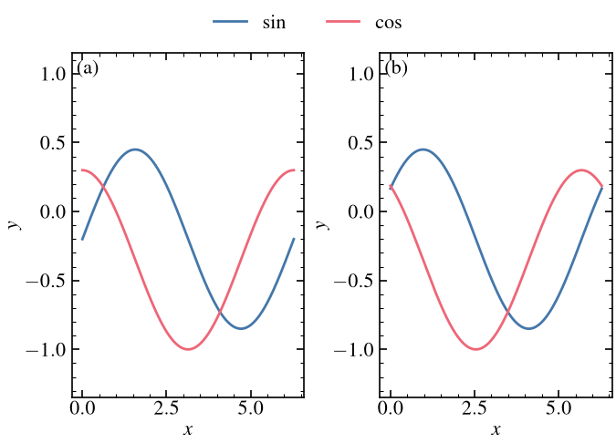
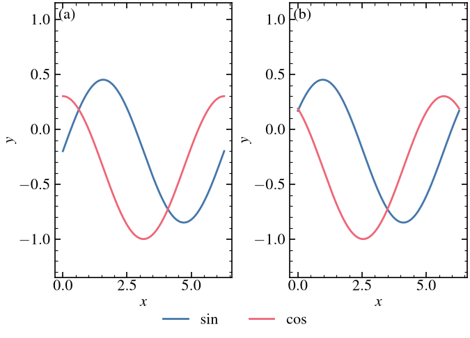
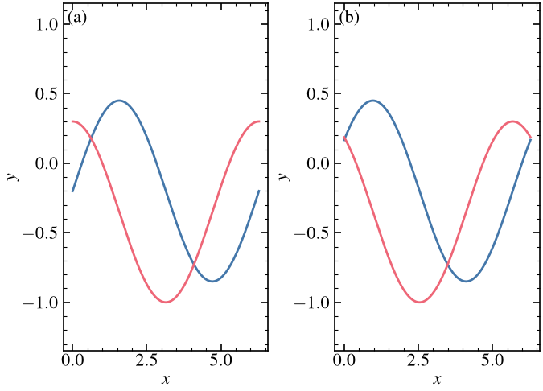
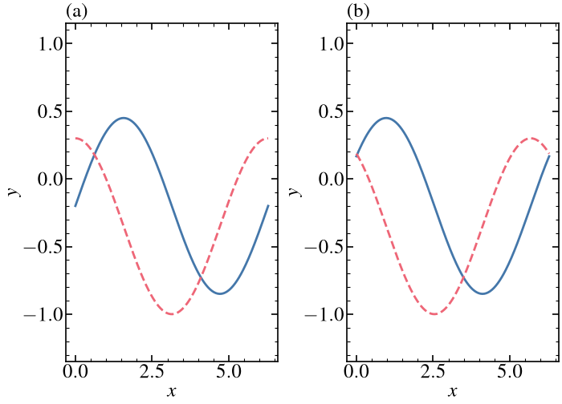
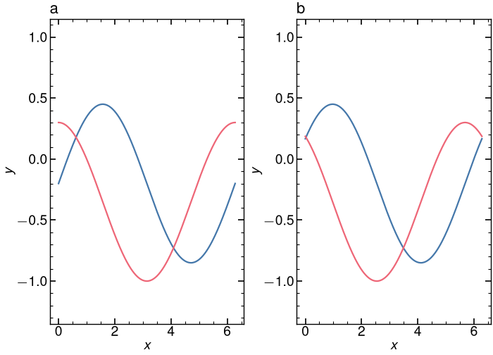
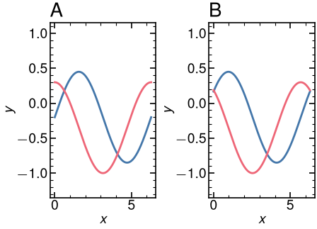
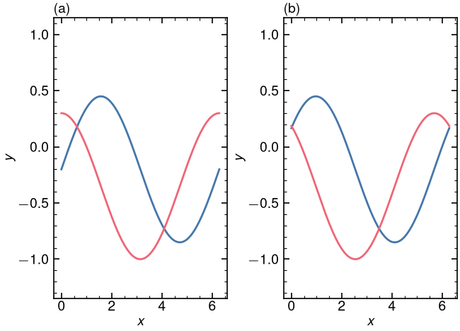
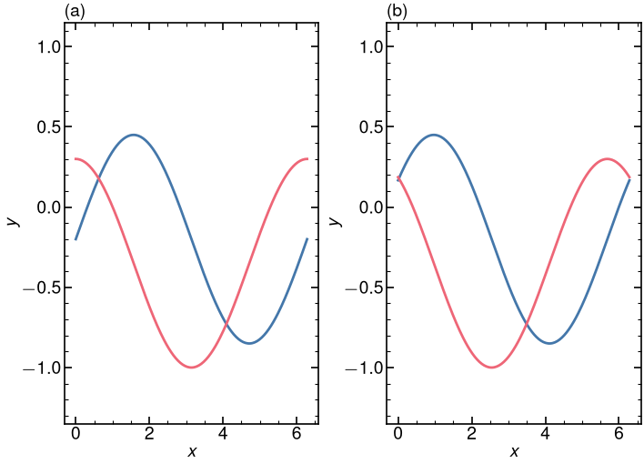
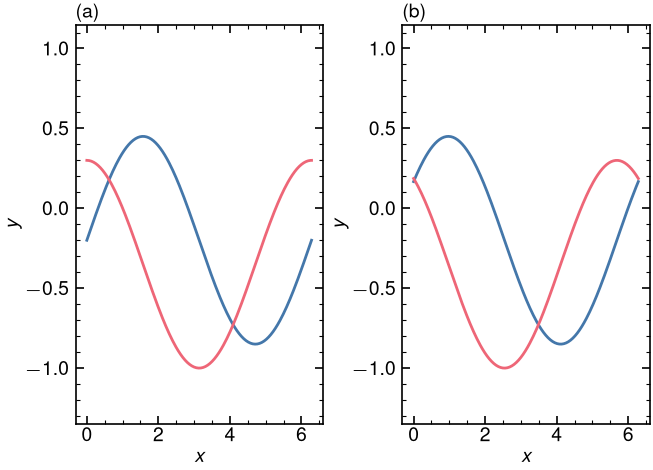

# 複数パネル

この見本は 1 段幅で、パネルは横に 2 枚です。図全体を 2 段にするときは `columns=2` にします。

Physical Review の (a) は軸の内側、左上です。空いている角に置きます。Nature と Science の折れ線は軸の外、左上です。画像とヒートマップは `inside=True` で枠の内側に入れます。

| 雑誌 | パネル記号 | サイズ | 折れ線での位置 |
| --- | --- | --- | --- |
| APS | (a), (b) | 8 pt | 軸の内側、左上 |
| IEEE, ACS, Elsevier, RSC | (a), (b) | 本文と同じ | 軸の外、左上 |
| Nature | a, b（括弧なし、立体の太字） | 8 pt | 軸の外、左上 |
| Science | A, B（大文字の太字） | 10 pt | 軸の外、左上。画像は枠内 |

```python
import journalstyle as js

fig, axes = js.subplots("aps", 1, 2, columns=1, aspect=0.72)
axes[0].plot(x, y1)
axes[1].plot(x, y2)
js.label_panels(axes, journal="aps")  # (a) inside the axes
fig.savefig("fig.pdf")
```

`aspect` は図全体の高さ / 幅です。

## 凡例

系列の名前は `js.legend` でパネルの外に置きます。`loc="above"` はパネルの上、`loc="below"` は横軸の下です。2 枚で線種が同じときは、ラベルを付けた側だけを渡します。

```python
fig, axes = js.subplots("aps", 1, 2, columns=1, aspect=0.72)
axes[0].plot(x, y1, label=r"$\sin$")
axes[0].plot(x, y2, label=r"$\cos$")
axes[1].plot(x, y3)
axes[1].plot(x, y4)
js.label_panels(axes, journal="aps")
js.legend(axes[0], loc="above")  # パネルの上
fig.savefig("fig.pdf")
```



横軸の下に置くときは `loc="below"` です。

```python
js.legend(axes[0], loc="below")
```



## APS Physical Review (`aps`)

記号 `(a)`、図の幅 3.375 in（1 段）。



## IEEE journals (`ieee`)

記号 `(a)`、図の幅 3.500 in（1 段）。



## Nature (`nature`)

記号 `a`、図の幅 3.504 in（1 段）。



## Science (AAAS) (`aaas`)

記号 `A`、図の幅 2.244 in（1 段）。



## ACS journals (`acs`)

記号 `(a)`、図の幅 3.250 in（1 段）。



## Elsevier (`elsevier`)

記号 `(a)`、図の幅 3.543 in（1 段）。



## RSC journals (`rsc`)

記号 `(a)`、図の幅 3.268 in（1 段）。


